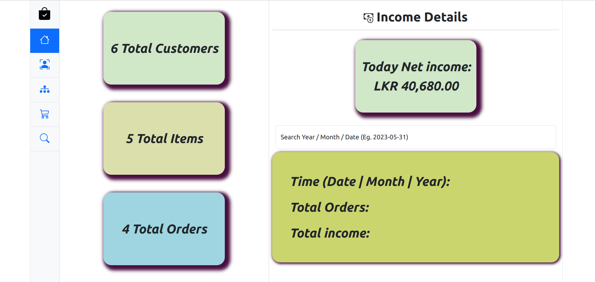
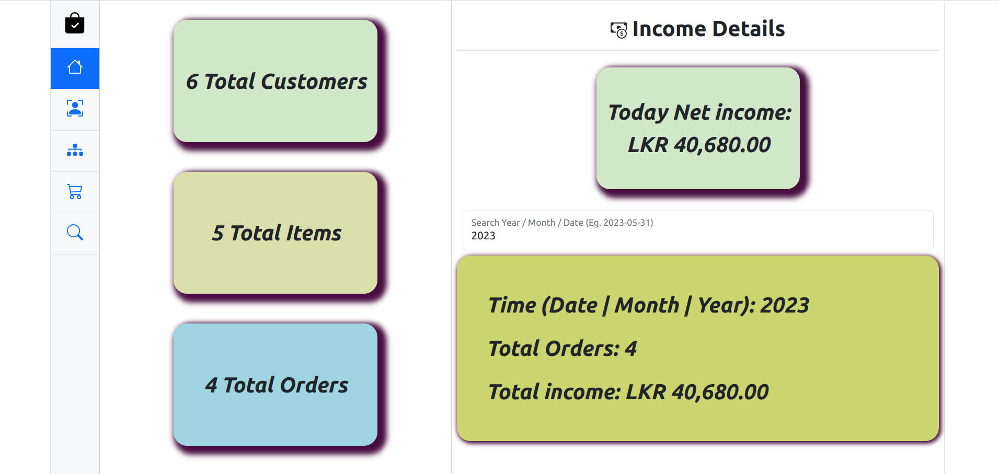
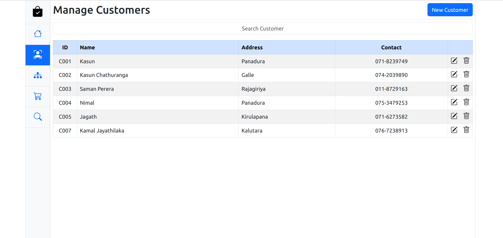
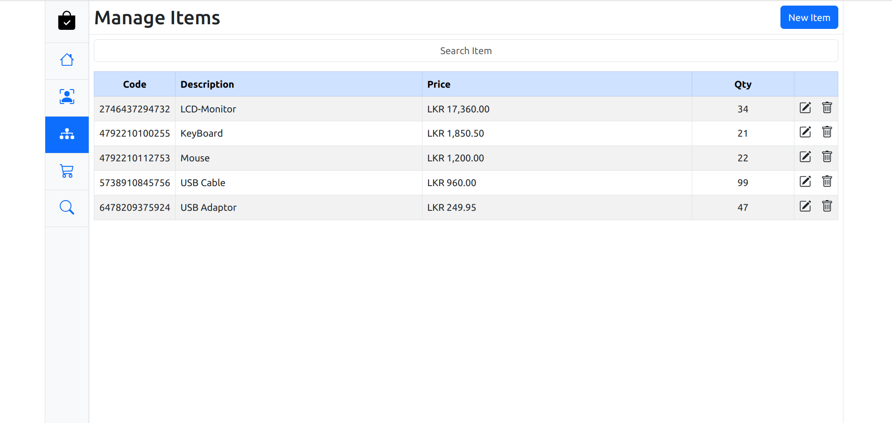
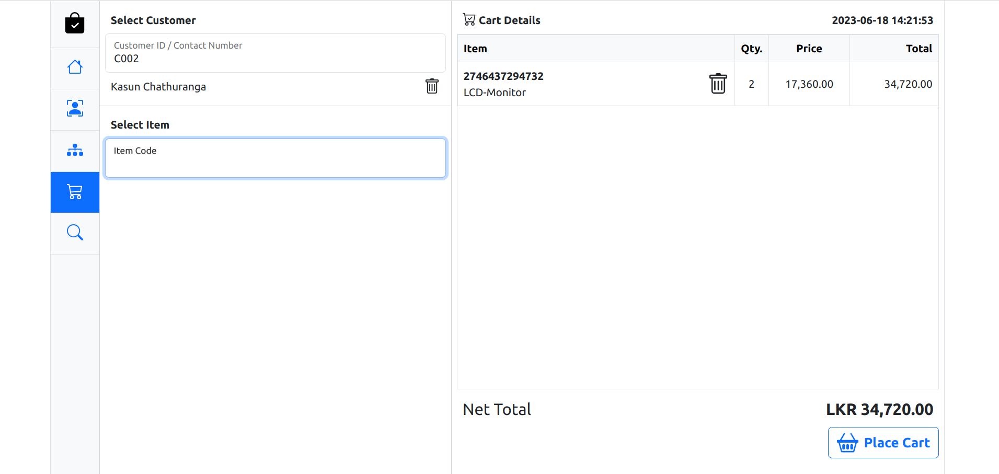
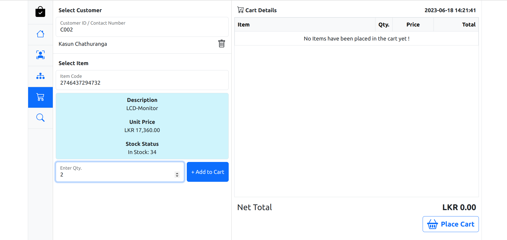
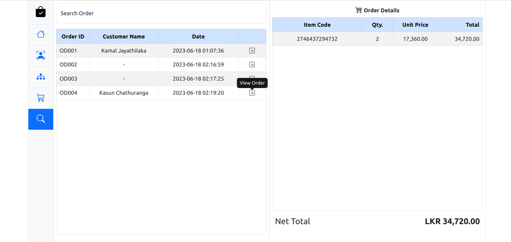
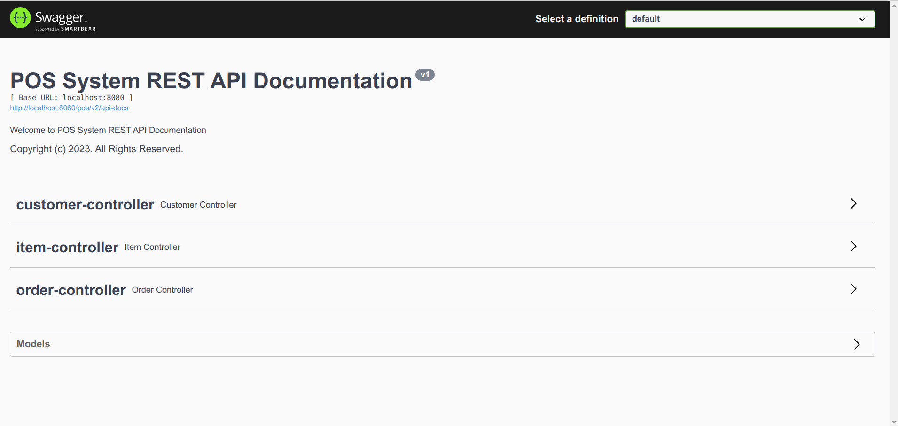

# Web Application POS System

This is a Point of Sale (POS) system web application that allows users to manage sales transactions, customers, items, and generate bills. It is built using a combination of front-end and back-end technologies.

## Technologies and Tools Used

### Front-End
- HTML5
- CSS3
- ECMAScript
    - Modules
- Web API
    - DOM API
    - XHR
    - LocalStorage
    - WebSocket
    - Intl
- Bootstrap
- Animate.CSS
- js-joda
- big.js
- jQuery
    - jQuery AJAX
- CSS Loaders
- Client-side Reporting

### Back-End
- Java 11
- Java SE 11
- Spring Framework (Spring Web MVC)
- Spring Web Socket
- Apache DBCP
- Lombok
- Junit jupiter
- Model mapper
- Hibernate validator
- Logging
  - Slf4J
  - Logback
- Jackson
    - Jackson datatype
- Swagger UI for API documentation
- Monolithic Architecture
- Layered Architecture
- DAO design pattern
- SOLID Principles
- Facade design pattern
- Factory design pattern
- Servant design pattern

### Database
- MySQL
- H2 database for testing

## Features

- Save, update, and delete Customer information.
- Save, update, and delete Item information.
- Place and process orders.
- Search orders based on various criteria.
- Generate and print bills.
- Track income and sales data on a time-wise basis.

## Getting Started

To get started with the POS system web application, follow these steps:

1. Clone the repository: `git clone https://github.com/KasunChathuranga3732/pos-system.git`
2. Set up the necessary configurations for the front-end and back-end technologies.
3. Install the required dependencies and libraries.
4. Build and deploy the application.
5. Access the application through the specified URL or port.

## License

Copyright &copy; 2023. All Rights Reserved.

## Contact

For any inquiries or support, please contact [Kasun Chathuranga](mailto:kasunchathuranga3732@gmail.com).

## Screen Shots
### Dashboard

#####

### Manage Customers

### Manage Items

### Place order

#####

### Search order

### API Documentation

